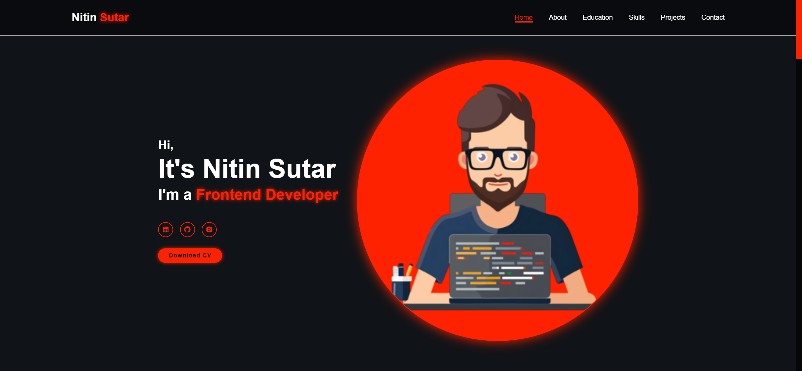
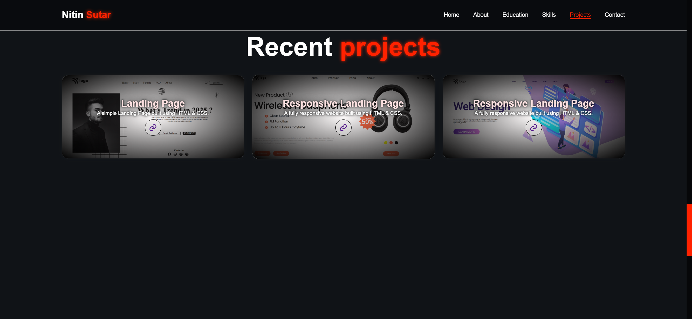

# 🚀 Portfolio Website - Nitin Sutar

Welcome to my personal portfolio website repository! This site showcases my skills, projects, and experiences as a frontend developer. It's a reflection of my journey in web development, combining responsive design and modern technologies to create a seamless user experience.

---

## 🌟 Live Demo
Check out the live version of my portfolio here: [Portfolio Website](https://nitin-sutar-portfolio.netlify.app/)

---

## 📖 Table of Contents
1. [Features](#features)
2. [Technologies Used](#technologies-used)
3. [Sections Overview](#sections-overview)
4. [How to Use](#how-to-use)
5. [Screenshots](#screenshots)
6. [Feedback](#feedback)

---

## ✨ Features
- **Responsive Design:** Optimized for all devices, from desktops to smartphones.
- **Dynamic Navigation Bar:** A sticky header with active link highlighting as you scroll through sections.
- **Interactive Projects Showcase:** Display of recent projects with hover effects and live links.
- **Social Media Integration:** Links to my LinkedIn, GitHub, and Instagram profiles.
- **Contact Form:** Simple and functional form for visitors to reach out.
- **Smooth Animations:** Subtle transitions and hover effects for enhanced user experience.

---

## 🛠️ Technologies Used
- **HTML5**: Semantic structure for the content.
- **CSS3**: Styling and responsive layouts.
- **JavaScript**: Interactivity and animations.
- **Font Awesome** & **Boxicons**: Icons for design elements.
- **Web3Forms API**: For contact form submission.

---

## 📋 Sections Overview
### 1. **Home**
- Introduction and professional tagline.
- Downloadable CV.

### 2. **About Me**
- Overview of my skills and passion for frontend development.

### 3. **Education**
- Details of my academic qualifications.

### 4. **Skills**
- Technologies and tools I am proficient in.

### 5. **Projects**
- Recent projects with descriptions and live demo links.

### 6. **Contact**
- Functional contact form powered by Web3Forms.

---

## ⚙️ How to Use
1. Clone the repository:
   ```bash
   git clone https://github.com/NitinTSutar/portfolio.git
   ```
2. Navigate to the project folder:
   ```bash
   cd portfolio
   ```
3. Open `index.html` in your preferred browser.

---

## 🖼️ Screenshots
### Home Section


### Projects Section


---

## 💬 Feedback
I’d love to hear your thoughts! Feel free to connect with me on:
- **[LinkedIn](https://www.linkedin.com/in/nitin-sutar-859a5b23a/)**
- **[GitHub](https://github.com/NitinTSutar)**
- **[Instagram](https://www.instagram.com/__.nitin_sutar__/)**

If you encounter any issues or have suggestions for improvement, don’t hesitate to open an issue or create a pull request.

---

Thank you for visiting my portfolio repository! 😊
